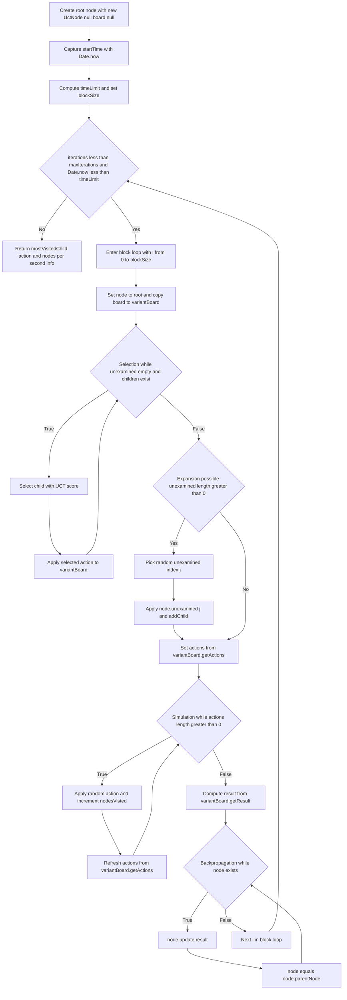
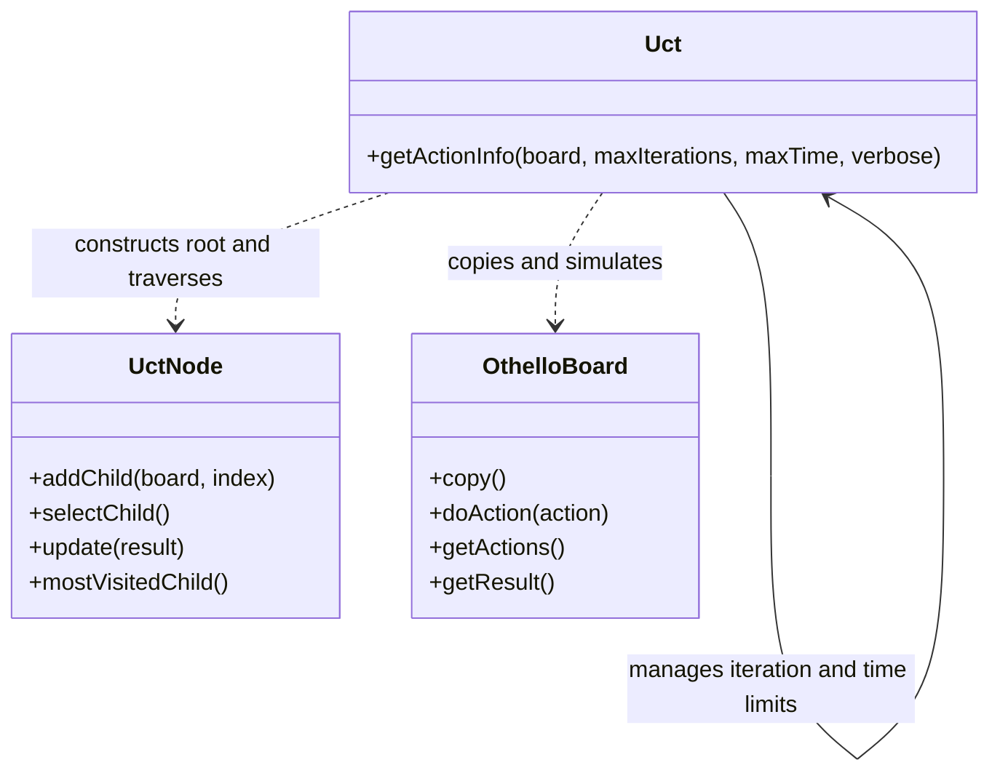
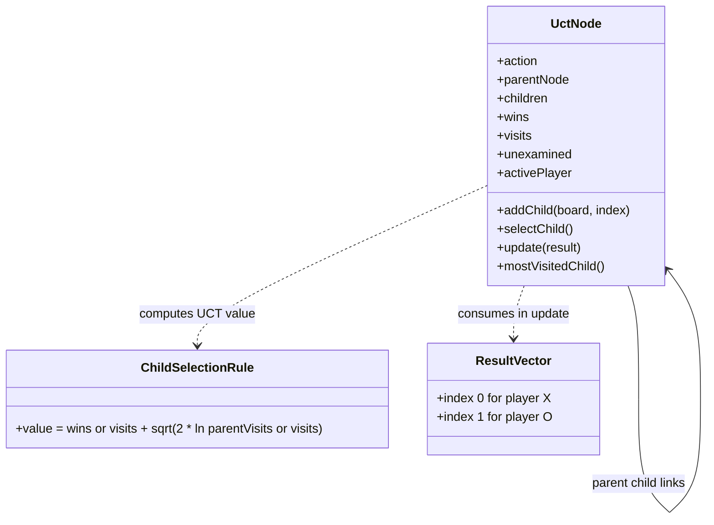
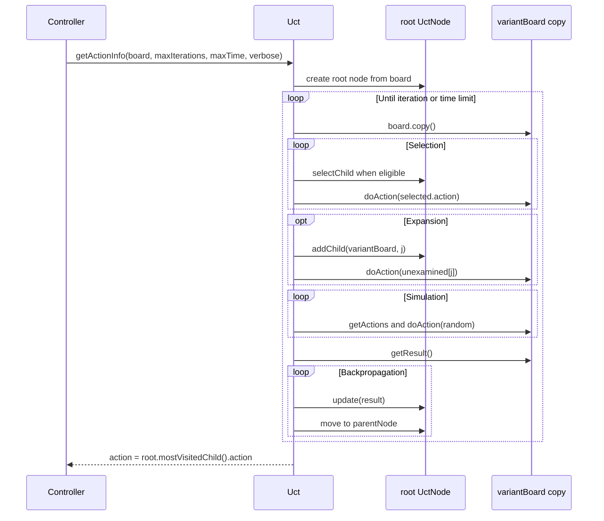
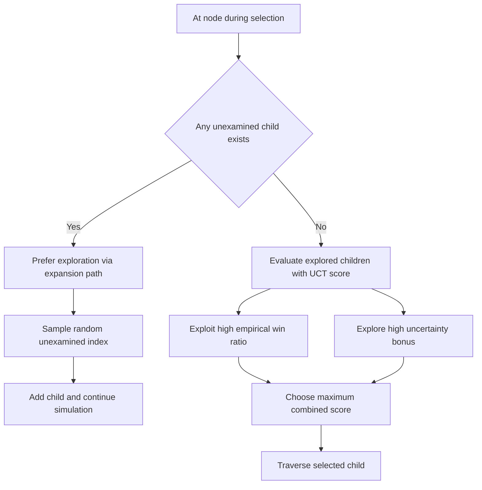
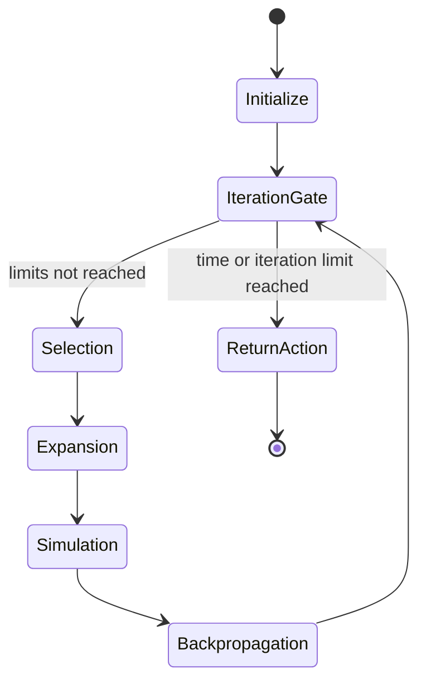

# MCTS UCT AI Engine

## Purpose

UCThello uses a Monte-Carlo Tree Search (MCTS) AI with an Upper
Confidence Bounds (UCB) selection strategy applied to trees (UCT).
The engine computes an action for the active player by repeatedly
simulating game continuations and updating search statistics.

This document extracts and consolidates the algorithm narrative that
was previously only embedded in [README.md](../README.md).

## Context and Scope

- Game domain: deterministic two-player board game with perfect
  information.
- Engine boundary: runs in a worker-side controller and is called by
  UI orchestration via message passing.
- Target behavior: return a high-quality next move within configured
  iteration and time limits.

## Core Data Structures

### Search node (UCT node)

Each search node represents an action applied to a board state and
stores:

- `children`: explored descendant nodes.
- `unexamined`: legal actions not expanded yet.
- `wins`: accumulated score from simulations.
- `visits`: number of traversals through the node.
- `parentNode`: back link for backpropagation.
- `activePlayer`: player perspective for scoring updates.

### Variant board copy

Each iteration works on a copied board state (`variantBoard`) so search
simulation does not mutate the live game state.

## Code-Reflective AI Engine Flow

The following flowchart closely follows the control flow in
[html5/src/js/uct/uct.js](../html5/src/js/uct/uct.js).



## UML Class Diagram for uct.js

This class view reflects callable behavior in
[html5/src/js/uct/uct.js](../html5/src/js/uct/uct.js).



## UML Class Diagram for uctnode.js

This class view reflects state and behavior in
[html5/src/js/uct/uctnode.js](../html5/src/js/uct/uctnode.js).



## Additional UML Views

## Sequence Diagram: controller to engine search

This sequence aligns with worker-side orchestration and UCT execution.



## Activity Diagram: exploration and exploitation split



## State Machine Diagram: one getActionInfo call



## The Four MCTS UCT Stages

## 1. Selection

Objective: traverse from root to a promising leaf while the traversed
part of the tree remains structurally unchanged.

Typical loop in UCThello:

```javascript
let node = root;
const variantBoard = board.copy();
while (node.unexamined.length === 0 && node.children.length > 0) {
  node = node.selectChild();
  variantBoard.doAction(node.action);
}
```

Interpretation:

- `node.unexamined.length === 0`: all actions for this node were
  already expanded.
- `node.children.length > 0`: traversal can continue down the tree.
- `selectChild()`: chooses the next branch according to UCT score.

Terminal cases:

- If a terminal state is reached, expansion and simulation may become
  no-ops for that iteration.

## 2. Expansion

Objective: add exactly one new child node from remaining unexamined
actions, when possible.

Typical pattern:

```javascript
if (node.unexamined.length > 0) {
  const j = Math.floor(Math.random() * node.unexamined.length);
  variantBoard.doAction(node.unexamined[j]);
  node = node.addChild(variantBoard, j);
}
```

Interpretation:

- One unexamined action is chosen (randomized tie-break on the action
  list).
- The chosen action is applied to the variant board.
- A new search child is created and attached.

## 3. Simulation

Objective: from the expanded node, perform a playout to an end-of-game
state.

Typical pattern:

```javascript
let actions = variantBoard.getActions();
while (actions.length > 0) {
  variantBoard.doAction(actions[Math.floor(Math.random() * actions.length)]);
  actions = variantBoard.getActions();
}
```

Interpretation:

- Simulation policy is random over currently legal actions.
- The rollout continues until no action remains.
- Exactly one playout is done per MCTS iteration in this engine.

## 4. Backpropagation

Objective: propagate simulation outcome from the reached node back to
the root, updating statistics.

Typical pattern:

```javascript
const result = variantBoard.getResult();
while (node) {
  node.update(result);
  node = node.parentNode;
}
```

Interpretation:

- The final playout result is transformed into node statistics.
- Every node on the traversed path receives an update.

UCThello scoring semantics:

- Win/loss encoded as `[1, 0]` or `[0, 1]`.
- Draw encoded as `[0.5, 0.5]`.
- Node update uses perspective of `activePlayer` for that node.

## Exploration vs Exploitation

Selection must balance two conflicting goals:

- Exploitation: pick branches with strong observed reward so far.
- Exploration: keep trying uncertain branches to reduce estimation
  error and avoid local bias.

UCT typically uses a score of this form:

$$
\text{UCT}(i) = \frac{w_i}{n_i} + c\sqrt{\frac{\ln N}{n_i}}
$$

Where:

- $w_i$: accumulated wins/score for child $i$.
- $n_i$: visits of child $i$.
- $N$: visits of the parent node.
- $c$: exploration constant.

Term intuition:

- $\frac{w_i}{n_i}$ is empirical quality (exploit term).
- $\sqrt{\frac{\ln N}{n_i}}$ is uncertainty bonus (explore term).
  It is high for rarely visited children and shrinks as $n_i$ grows.

Practical behavior over time:

- Early search: exploration dominates due to sparse visits.
- Mid search: uncertain children are still sampled but less often.
- Late search: high-value stable branches dominate.

Additional UCThello preference:

- Unexamined children are preferred before already explored siblings.
  This widens the tree early and reduces the risk of missing useful
  branches near the root.

## Runtime Constraints and Quality Trade-offs

The AI strength is intentionally bounded for responsiveness and energy
efficiency:

- Hard limits by iteration count and/or wall clock time.
- Single worker thread for AI computations.
- UI remains responsive via separate main-thread rendering shell.

This design targets a practical balance between playing quality and
device constraints.

## Relationship to Other Documents

- Architecture view and UML landscape:
  [doc/software_architecture.md](software_architecture.md)
- Repository overview and links:
  [README.md](../README.md)
