# Software Architecture

## Architecture Specification

UCThello uses a modern browser-first architecture based on ES modules
and native browser APIs.
The runtime has no jQuery or jQuery UI dependency.

Extracted from repository abstract and AI notes in
[README.md](../README.md):

- UCThello is a board game demonstrator using an MCTS UCT AI engine.
- The project prefers responsive UX and bounded compute over
  maximum-strength search at any cost.

The system is intentionally split into:

- Functional core: deterministic, side-effect-free logic and helpers.
- Imperative shell: DOM interaction, event wiring, worker messaging, and orchestration.

This separation improves correctness, testability, and maintainability.

## Key Properties

- Functional core / imperative shell split.
- Deterministic helper module with high unit-test coverage.
- Browser-native UI behavior using semantic HTML, ARIA attributes,
  and keyboard support.
- Worker-based game engine boundary between presentation and search logic.

## Module View

### Imperative shell

- html5/src/js/hmi.js: UI orchestration, event lifecycle,
  board rendering calls, worker IO.
- html5/src/js/ui/widgets.js: tab and accordion initialization and event behavior.

### Functional core

- html5/src/js/ui/pure.js: pure helper functions for markup derivation,
  coordinate mapping, status formatting, and move parsing.

### Engine and game model side

- html5/src/js/controller.js: worker-side command processing and orchestration.
- html5/src/js/board.js: board state transitions and legal-action computation.
- html5/src/js/uct/uct.js and html5/src/js/uct/uctnode.js: UCT search behavior.
- html5/src/js/random/random.js: fallback move selection.

## AI Engine Documentation

Detailed algorithm explanation for the four MCTS UCT stages,
including exploration vs exploitation:

- [doc/mcts_uct_ai_engine.md](mcts_uct_ai_engine.md)

## Quality and Verification

- Unit tests: Vitest with jsdom for deterministic module
  and orchestration validation.
- End-to-end tests: Playwright for browser behavior.
- Coverage target: strict global thresholds configured for statements,
  branches, functions, and lines.
- Linting and formatting: Biome for code quality,
  markdownlint for documentation quality.

## UML Coverage (Mermaid)

### 1. Use case diagram

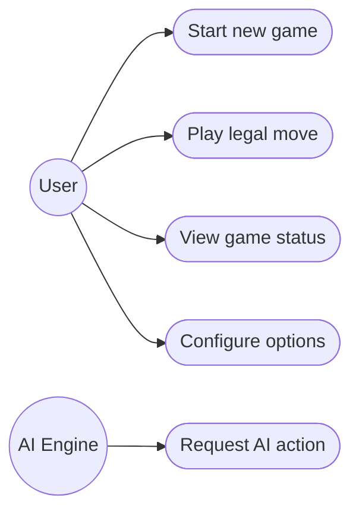

### 2. Class diagram

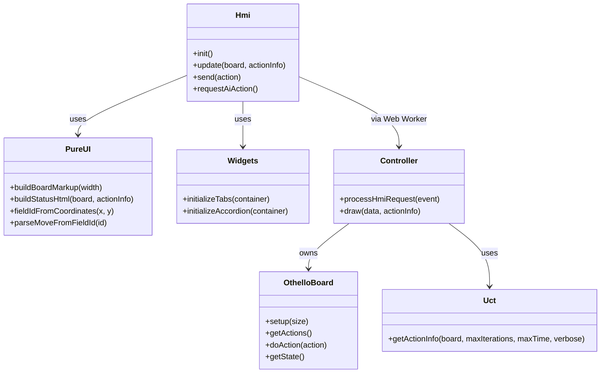

### 3. Object diagram

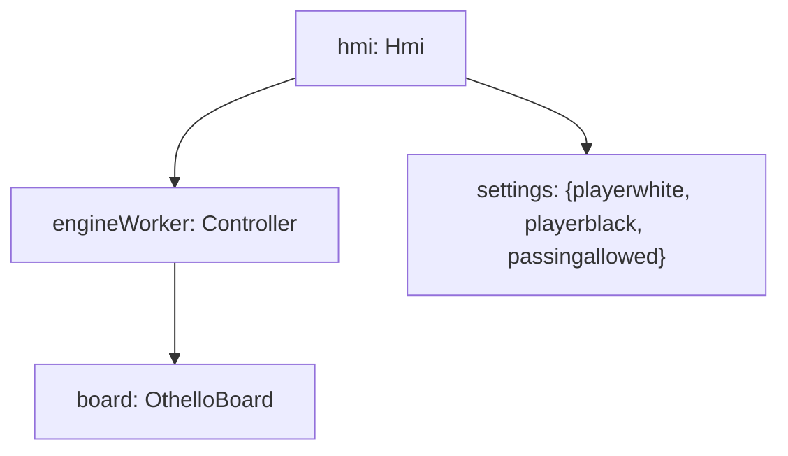

### 4. Package diagram

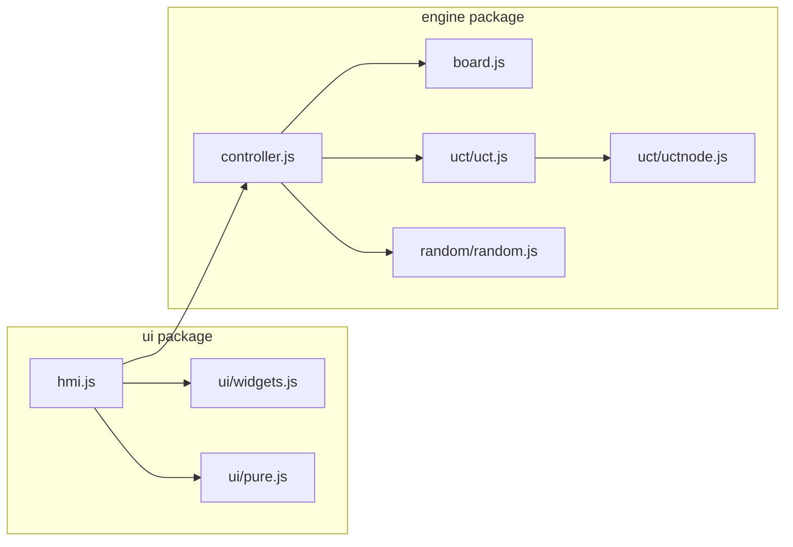

### 5. Component diagram

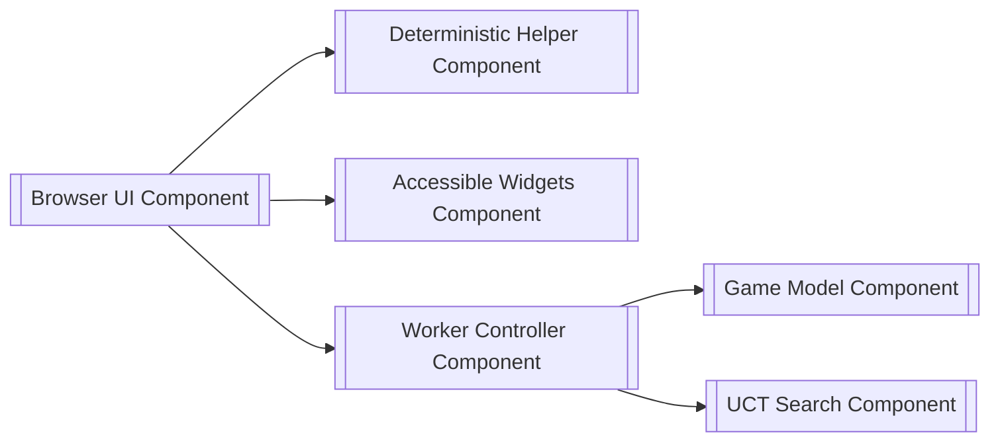

### 6. Composite structure diagram

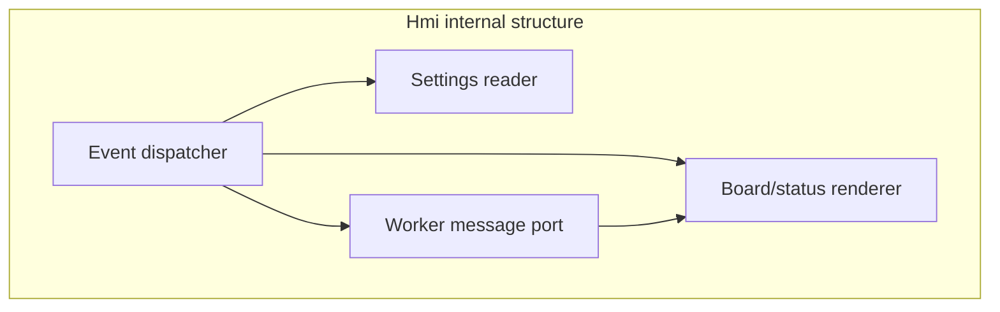

### 7. Deployment diagram

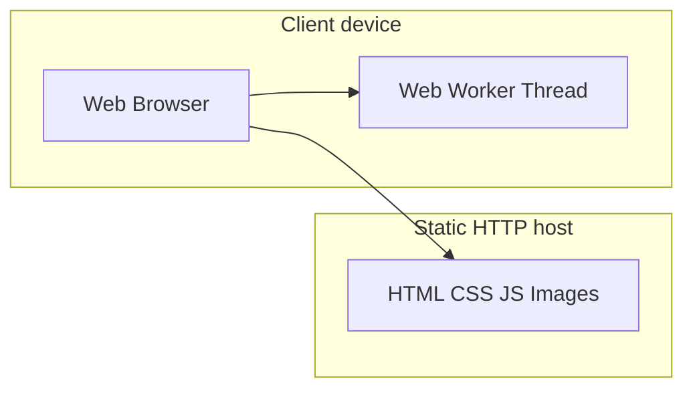

### 8. Profile diagram

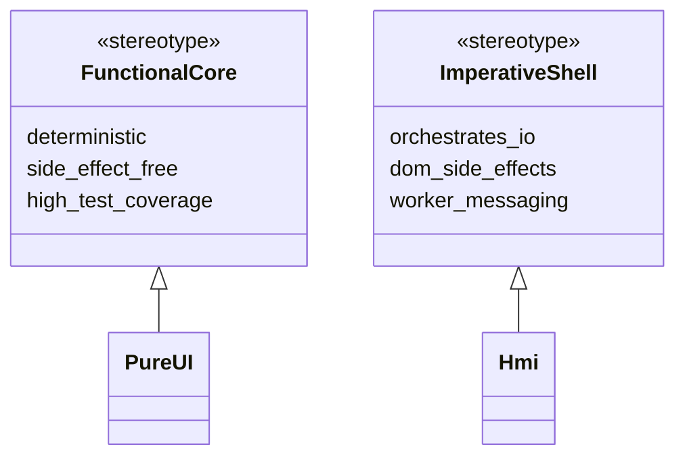

### 9. Activity diagram

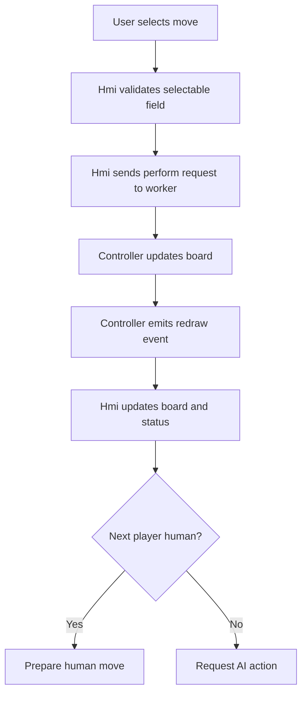

### 10. State machine diagram

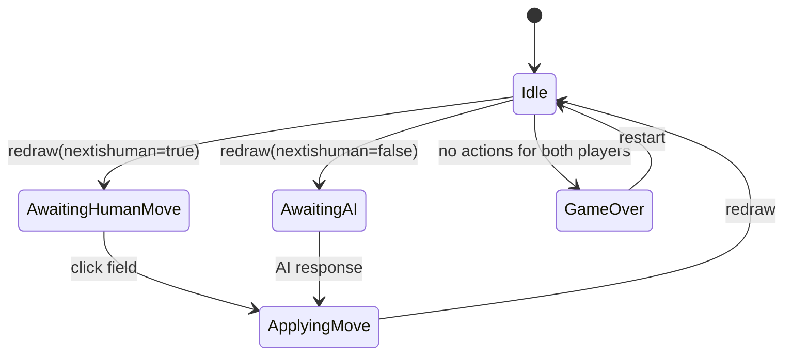

### 11. Sequence diagram

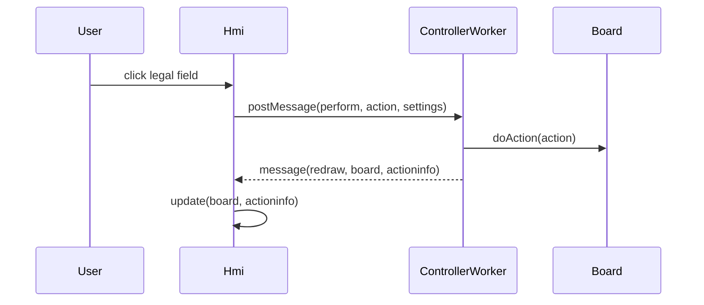

### 12. Communication diagram

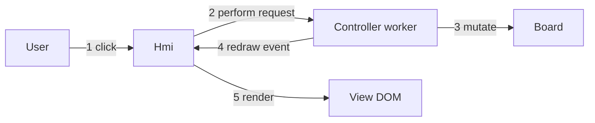

### 13. Interaction overview diagram

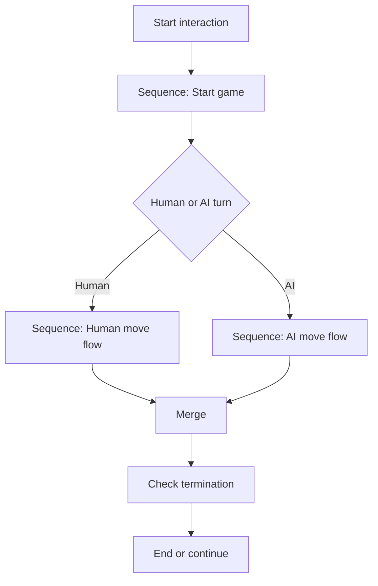

### 14. Timing diagram

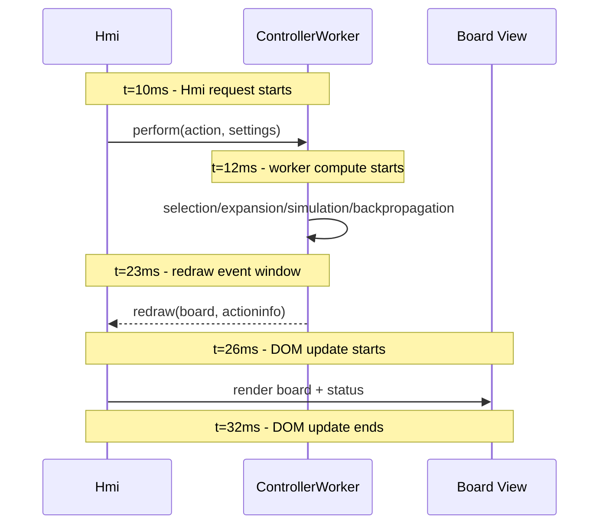

Compatibility note:
Some Mermaid renderers do not consistently support `timingDiagram`
or high-resolution axis formatting. This sequence-based timing view is
used as a stable cross-renderer fallback while preserving discrete
timing points.

## Architectural Decision Summary

- Keep domain/helper logic deterministic and testable in isolation.
- Keep side effects concentrated in orchestration boundaries.
- Preserve worker boundary to decouple rendering and decision-making workloads.
- Prefer standards-based browser features over heavy UI libraries.
